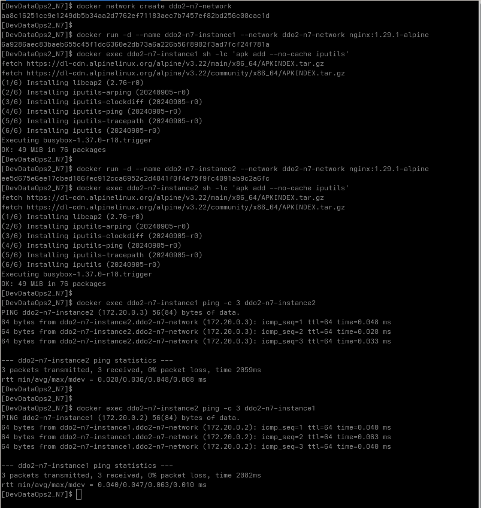

### Run 2 containers in the same network and prove communication between these containers

I created two Nginx HTTP server containers and installed the `ping` CLI tool in both containers to verify network connectivity.

Once both containers were up and running, I tested the connection by executing the `ping` command:
- From **instance1** to **instance2**
- From **instance2** to **instance1**

Instead of using IP addresses, I used the containers’ **domain names** for communication. This approach showcases Docker’s internal DNS resolution, which allows containers in the same network to reach each other by name.

#### Result
The successful ping results confirmed that the containers could communicate with each other over the network.

