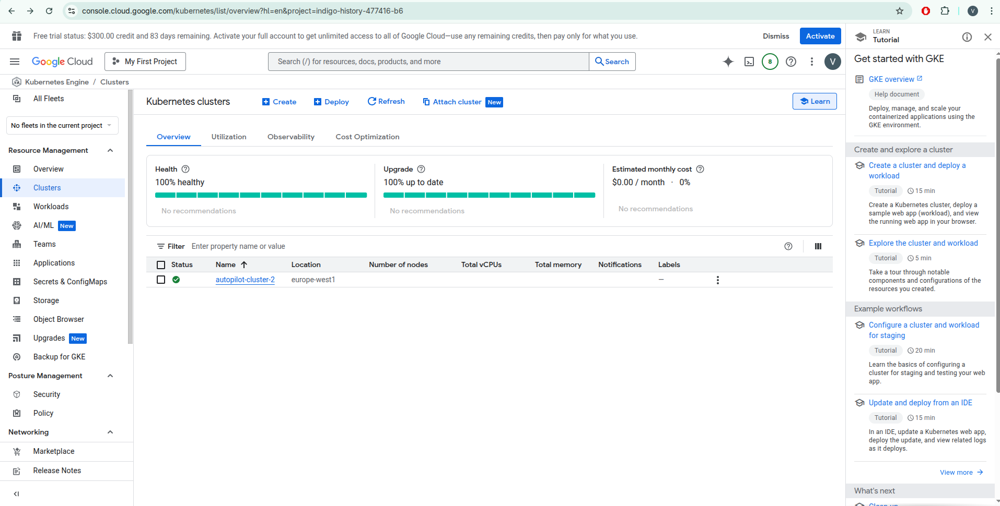
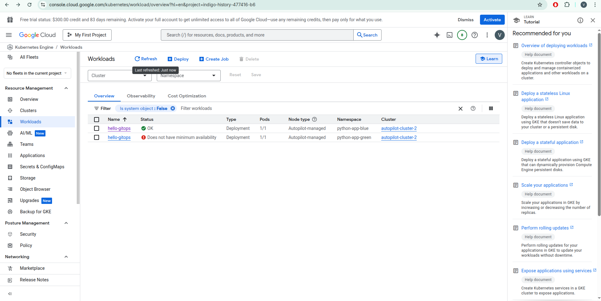

# GKE Blue\Green deployment

- Forked GitHub project: https://github.com/ViktorNovyk/github-actions-samples
- DockerHub project: https://hub.docker.com/repository/docker/intatl/hello-gitops
- Updated deployment to the latest plugins versions - https://github.com/ViktorNovyk/github-actions-samples/blob/main/.github/workflows/ci-cd-python-app.yml

#### Created Kubernetes cluster via a web console


#### Creating a service account

I followed the instructions here - https://docs.github.com/en/actions/how-tos/deploy/deploy-to-third-party-platforms/google-kubernetes-engine

```shell
gcloud auth login # Login to the sdk cli
gcloud config set project indigo-history-x # Set the project
gcloud iam service-accounts create uku-gke-hw4 # Create a service account
gcloud iam service-accounts list # Getting the SA email

# Init env vars
SA_EMAIL="uku-gke-hw4@indigo-history-x.iam.gserviceaccount.com"
GKE_PROJECT="indigo-history-x"

# Setting the IAM policy binding
gcloud projects add-iam-policy-binding $GKE_PROJECT \
--member=serviceAccount:$SA_EMAIL \
--role=roles/container.admin
gcloud projects add-iam-policy-binding $GKE_PROJECT \
--member=serviceAccount:$SA_EMAIL \
--role=roles/storage.admin
gcloud projects add-iam-policy-binding $GKE_PROJECT \
--member=serviceAccount:$SA_EMAIL \
--role=roles/container.clusterViewer

# Downloading the key
gcloud iam service-accounts keys create key.json --iam-account=$SA_EMAIL
```

The created SA keys were added to the GitHub Actions secrets with the name **GCP_SA_KEY**

#### Updated deployment workflow

Updated the deployment to the latest plugins versions. https://github.com/ViktorNovyk/github-actions-samples/blob/main/.github/workflows/ci-cd-python-app.yml

The first deployment:


The second deployment (before the namespace is deleted):


The second deployment (after the namespace is deleted):


Link the deployment workflow. https://github.com/ViktorNovyk/github-actions-samples/actions/workflows/ci-cd-python-app.yml