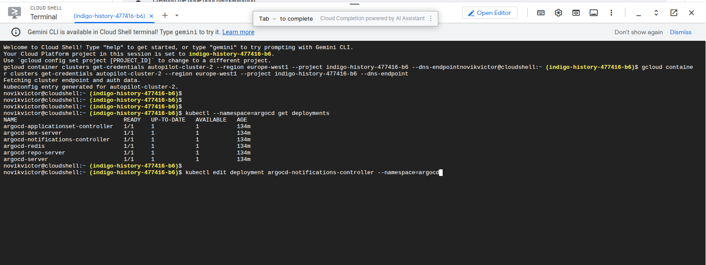
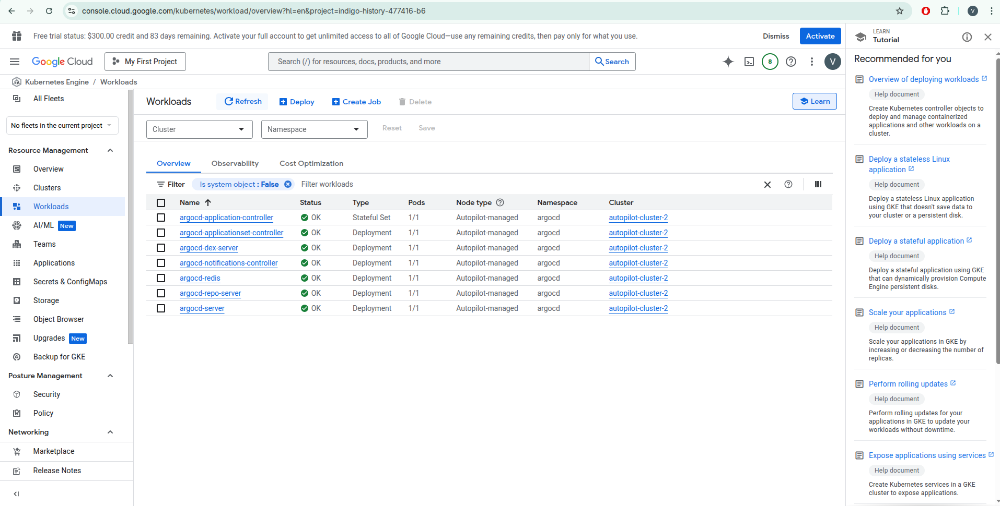
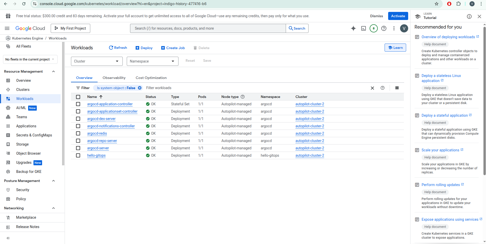
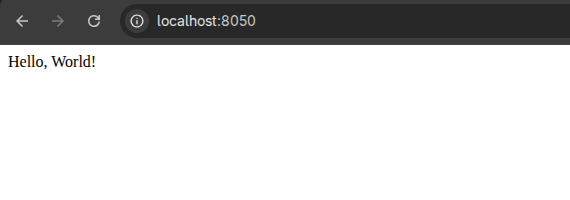

# Deploy changes from GitHub Actions and ArgoCD

- Forked GitHub project: https://github.com/ViktorNovyk/github-actions-samples
- DockerHub project: https://hub.docker.com/repository/docker/intatl/hello-gitops

#### Created Kubernetes cluster via a web console


#### When the cluster is ready, I configured the gcloud cli to connect to the kubernetes cluster via kubectl
```shell
   gcloud config set project indigo-history-x
   gcloud container clusters get-credentials autopilot-cluster-2 --zone europe-west1 --project indigo-history-x
```
After it the kubectl will be configured to a new config context - gke_indigo-history-X_europe-west1_autopilot-cluster-2

#### Creating a namespace and deploy argocd
```shell
kubectl create namespace argocd
kubectl apply -n argocd -f https://raw.githubusercontent.com/argoproj/argo-cd/stable/manifests/install.yaml
```
As I used a free tier, I had to manually update the deployments and set cpu to 250m and memory to 0.5Gi as well as deployment strategy to Recreate.

Screenshot from a cloud shell with a list of deployments and edit command:


Screenshot with running argocd pods:


#### Configuring the ArgoCD

Getting the admin password
```shell
kubectl -n argocd get secret argocd-initial-admin-secret -o jsonpath="{.data.password}" | base64 -d; echo
```

Port forwarding to access the ArgoCD web interface
```shell
kubectl port-forward svc/argocd-server -n argocd 8080:443
```

Screenshot with the configured application:


Screnshot with the deployment details:


#### Configuring the application
Port forwarding to access the app web interface
```shell
kubectl port-forward svc/hello-gitops -n hello-gitops 8050:8050
```

Screenshot with running ArgoCD and application pods:


Screenshot with app response:



Screenshot with GitHub Actions workflow:

