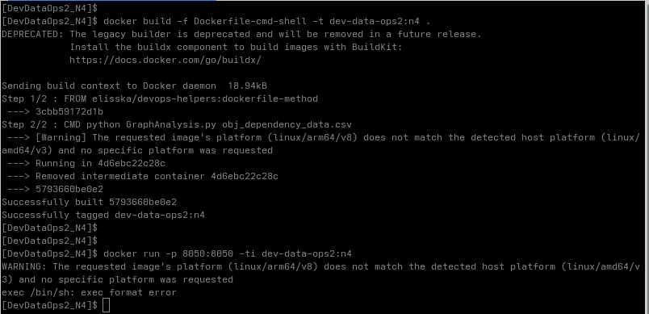
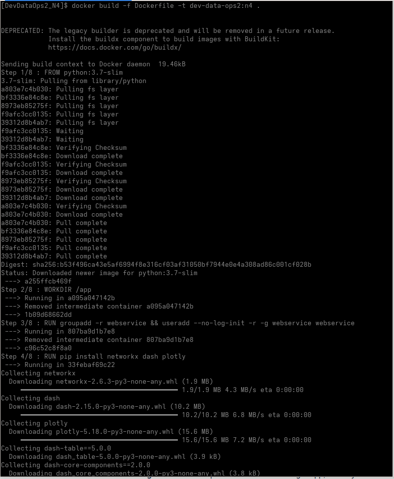
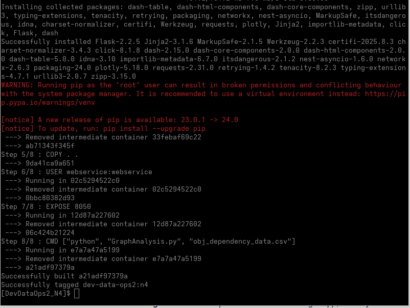
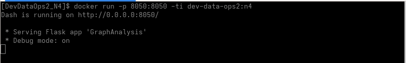
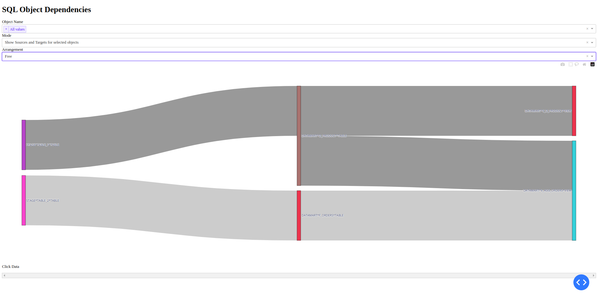

## Run Sample Application in docker container

### Attempt with `Dockerfile-cmd-shell`
Initially, I tried to build and run the Docker image using [Dockerfile-cmd-shell](sample-app/Dockerfile-cmd-shell) but encountered the following issue:

---

### Successful Build with `Dockerfile`
I switched to using the standard [Dockerfile](sample-app/Dockerfile), which worked successfully.

#### Build Process
Below are the screenshots capturing the build process:

- 
- 
- 

---

### Running the App
After successfully building the image, I proceeded to run the container.

#### Run Process
- 

#### Webpage Access
- 
