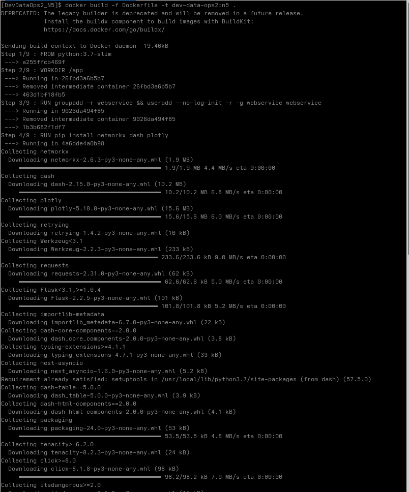
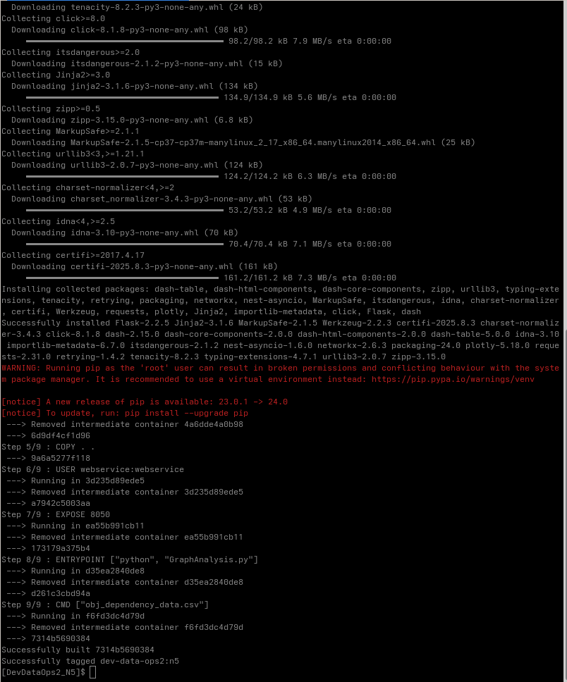
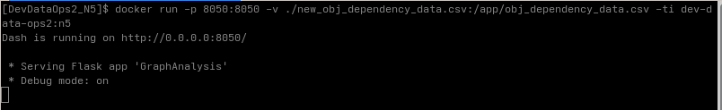
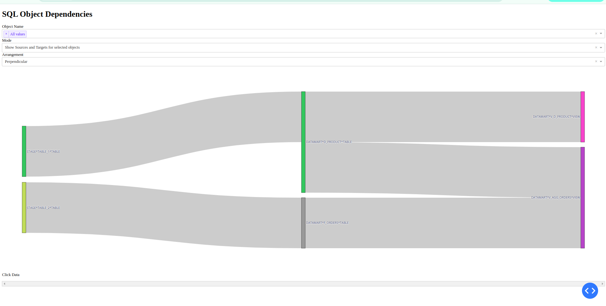

### Visualize another data file with Sample application (use bind mounts & entrypoint & cmd combination)

#### Building the Docker Image
Below are the screenshots capturing the build process:

- 

- 

---

#### Running the Docker Container with a Custom CSV
Running the container using a bind-mounted [CSV file](new_obj_dependency_data.csv)

1. **Running the Container**  
   

2. **Webpage with the Custom CSV**  
   

---

#### Running with the Default CSV
If no bind volume is provided, the container will use the default CSV file.

1. **Running the Container (Default CSV)**  
   

2. **Webpage with the Default CSV**  
   
