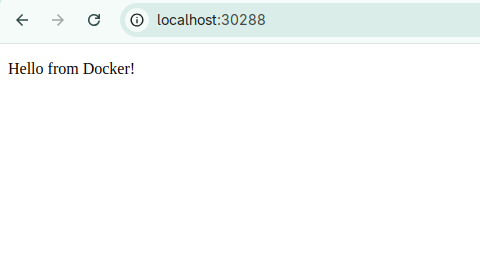
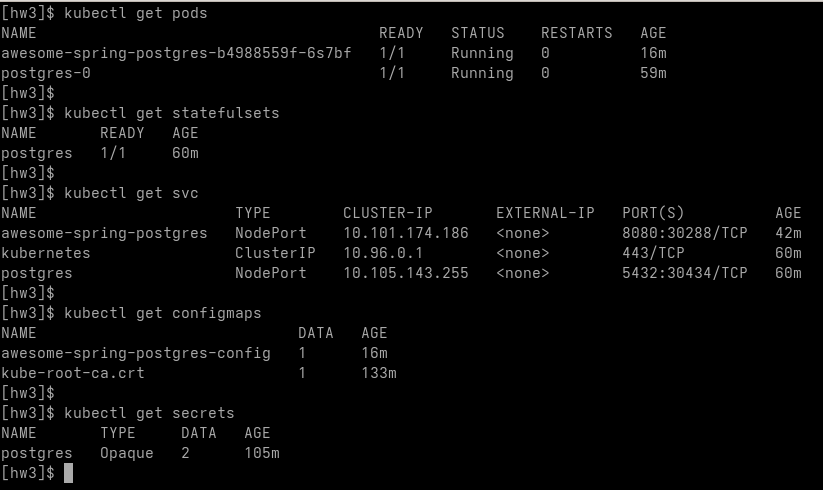

# Convert awesome spring-postgres to Kubernetes

## Overview

This project demonstrates the conversion of the [awesome spring-postgres](https://github.com/docker/awesome-compose/tree/master/spring-postgres) application to run on Kubernetes.

## Screenshots
- Running application

- Running k8s objects

## Deployment Files

The Kubernetes deployment consists of **2 main configuration files**:

| File | Description |
|------|-------------|
| [postgresql.yaml](k8s/postgresql.yaml) | Database deployment configuration |
| [app.yaml](k8s/app.yaml) | Spring Boot application configuration |

---

## PostgreSQL Deployment (`postgresql.yaml`)

- **Credentials Secret**
  - Database username and password management
- **StatefulSet Deployment**
  - Persistent volume claim template included
- **Service Exposure**
  - NodePort service type for localhost access

---

## Spring Boot Application (`app.yaml`)

- **ConfigMap**
  - PostgreSQL connection URL configuration
- **Application Deployment**
  - Uses ConfigMap and Secret from `postgresql.yaml`
- **Service Exposure**
  - NodePort service type for localhost access

