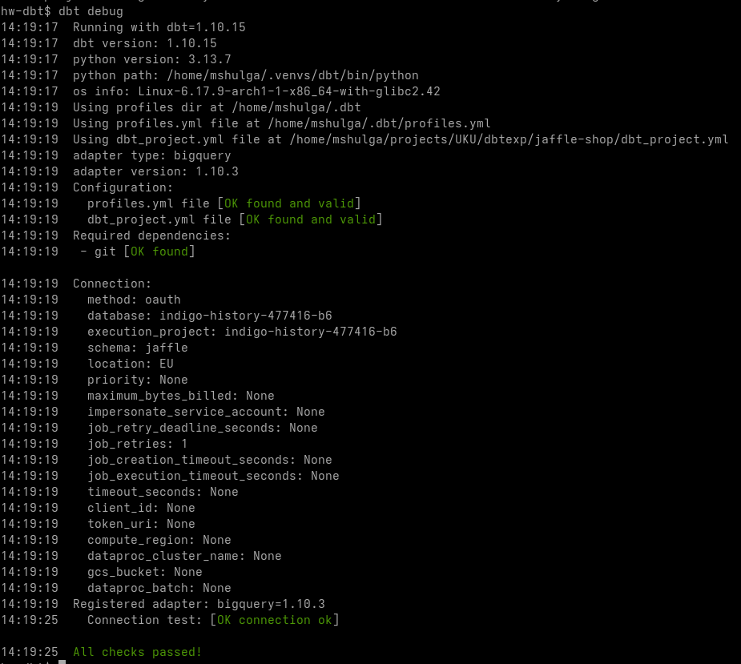
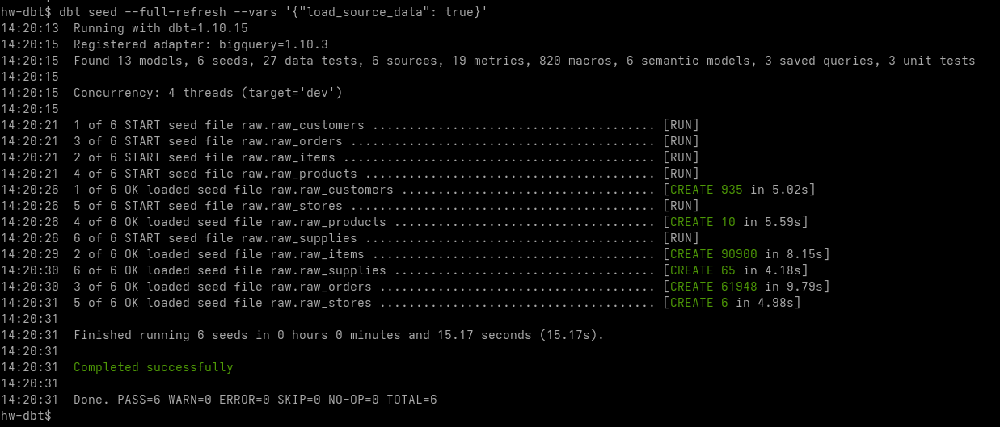
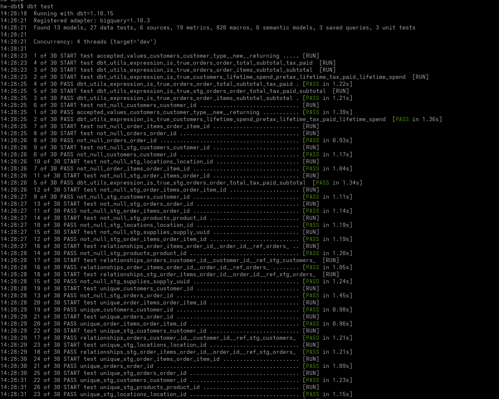
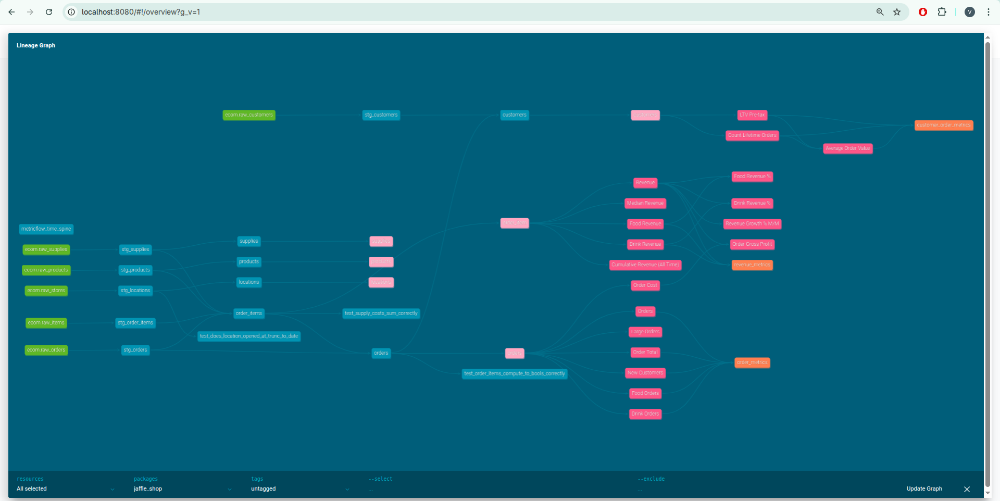
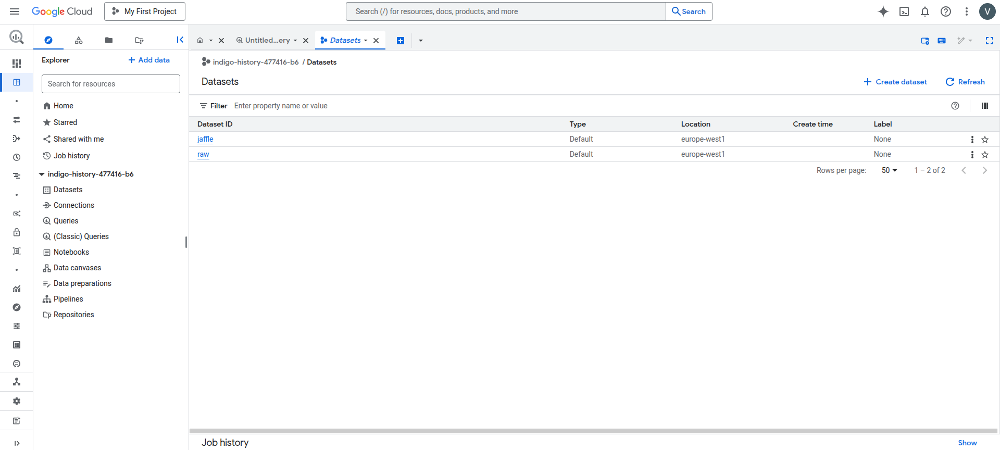
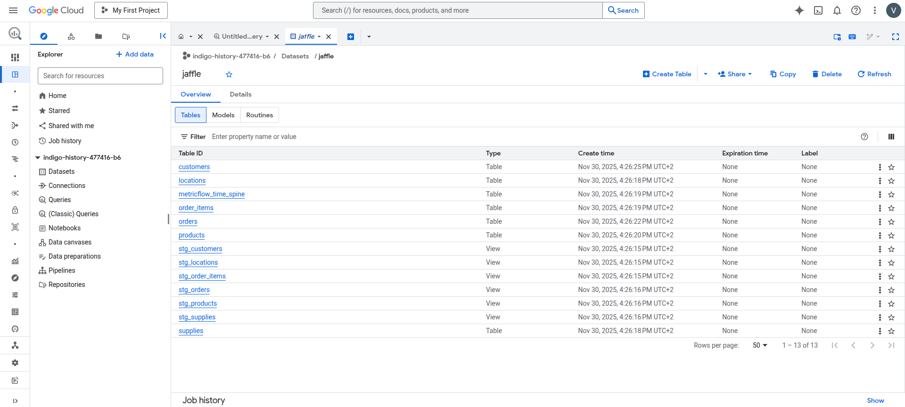
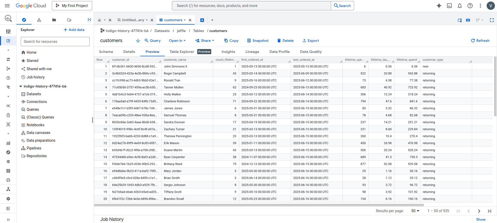

# Run juffle shop via DBT

I used BigQuery as a warehouse.

### Log of executed commands
```shell
dbt debug
```


```shell
dbt seed
```


```shell
dbt run
```


```shell
dbt test
```



### Lineage graph


### Tables overview

Datasets:


Jaffle dataset tables:


Data in the customer table:
