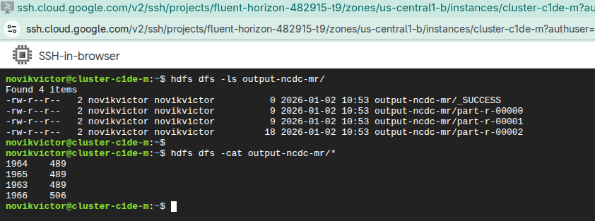
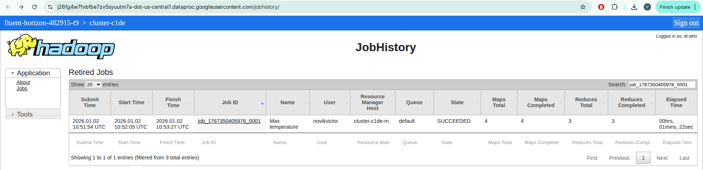
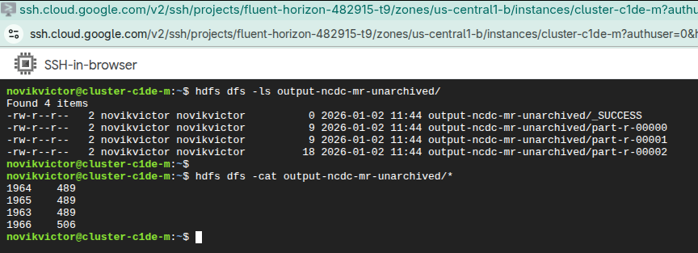
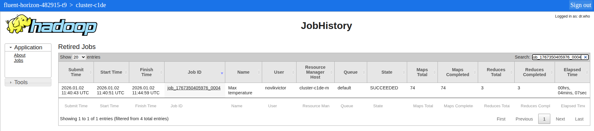

# Homework 3

## Assignment 1
Run MaxTemperature application with archived files

### Screenshots

Overview of the application execution result


Maps\Reducers used.


**Result:** 4 Maps were used as source files are .gs archives that can't be split.

## Assignment 2
Run MaxTemperature application with unarchived files

### Screenshots

Overview of the application execution result


Maps\Reducers used.


**Result:** 74 Maps were used as the source files were split by block size and parallelized.

```shell
hdfs getconf -confKey dfs.blocksize

> 134217728
```
 - 1963 file size is 3_158_030_838 bytes. 3_158_030_838/ 134_217_728 = 23.52 (24)
 - 1964 file size is 2_875_307_014. 2_875_307_014 / 134_217_728 = 21.42 (22)
 - 1965 file size is 1_806_949_508. 1_806_949_508 / 134_217_728 = 13.46 (14)
 - 1966 file size is 1_814_878_979. 1_814_878_979 / 134_217_728 = 13.52 (14)

Total: 24 + 22 + 14 + 14 = 74 

## Comparison of the app executions

|            |  Archived  | Unarchived |
|:-----------|:----------:|-----------:|
| Execution time   | 1min 22sec |  4min 7sec |
| # Maps |     4      |         74 |
