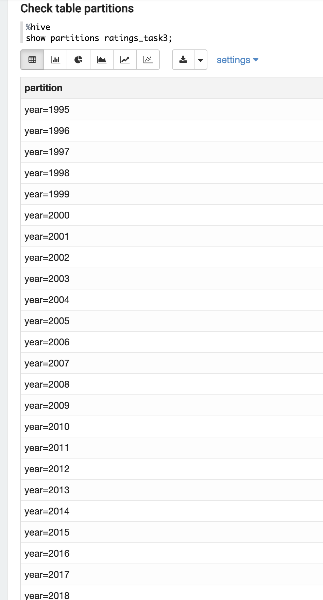
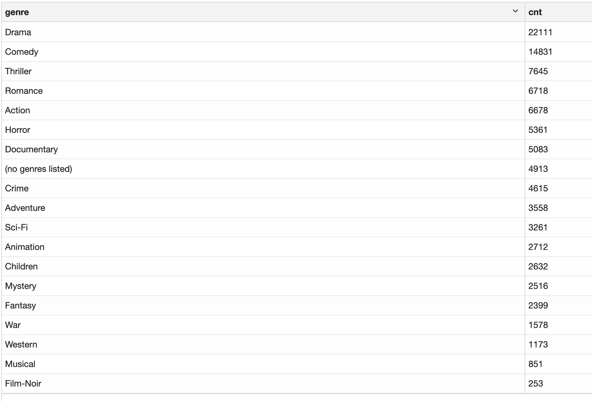
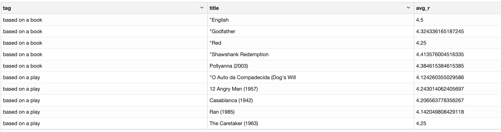

# Homework 4

## Assignment 3
Partitioned ratings table by year

#### Create a table
```hiveql
CREATE TABLE IF NOT EXISTS ratings_task3
(
  UserID            int,
  MovieID           int,
  Rating            double,
  Time_stamp         timestamp
)
PARTITIONED BY (year int)
STORED AS ORC;
```

#### Init data
```hiveql
SET hive.exec.dynamic.partition=true;
SET hive.exec.dynamic.partition.mode=nonstrict;
SET hive.execution.engine=mr;

INSERT OVERWRITE TABLE ratings_task3 PARTITION (year)
Select 
    UserID, 
    MovieID, 
    Rating, 
    from_unixtime(time_stamp) as time_stamp,  
    year(from_unixtime(time_stamp)) as year
from ratings;
```
### Result



## Assignment 4
Count a number of movies by genre, sort counts by desc, filter by genre > 200.

#### The query
```hiveql

select genre, count(1) as cnt from movies m
lateral view outer explode(split(genres,'\\|')) t1 as genre
group by genre
having cnt > 200
order by cnt desc;
```
### Result



## Assignment 5
Top 5 movies with the highest average rating with tags 'based on a book' and 'based on a play'.

#### The query
```hiveql
with movie_avg as (
    select t.tag, r.movieid, avg(r.rating) avg_r from ratings r
    join tags t on t.movieid = r.movieid
    where t.tag in ('based on a book', 'based on a play')
    group by t.tag, r.movieid
),
     movie_dense_rank as (
         select
             tag, movieid, avg_r, 
             dense_rank() over (partition by tag order by avg_r desc) as dr
         from movie_avg
     )
select mdr.tag, m.title, mdr.avg_r
from movie_dense_rank mdr
join movies m on m.movieid = mdr.movieid
where mdr.dr <= 5
order by mdr.tag, m.title, mdr.dr;
```
### Result


