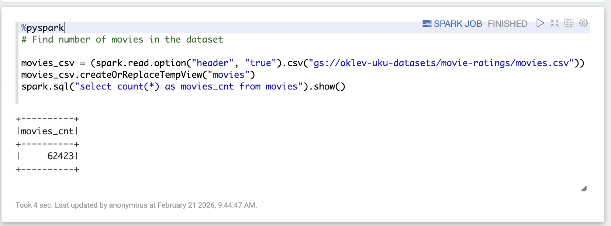
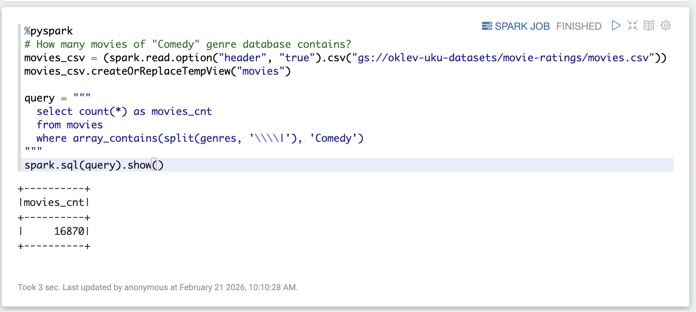
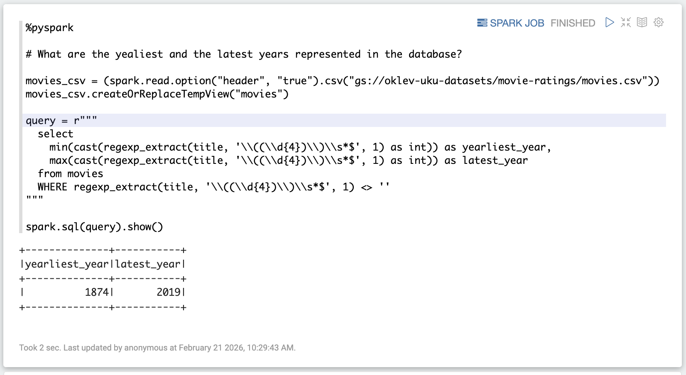
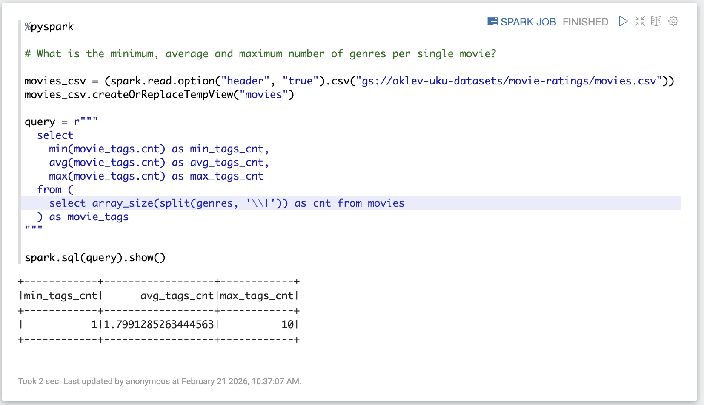
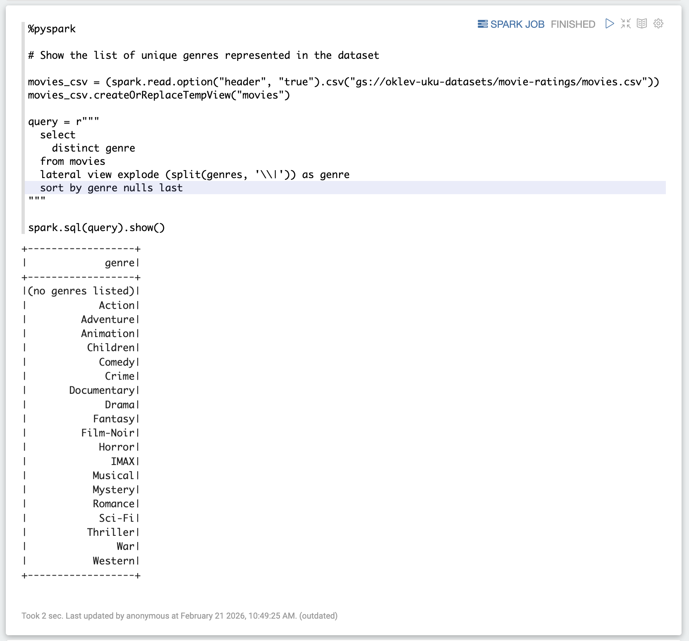
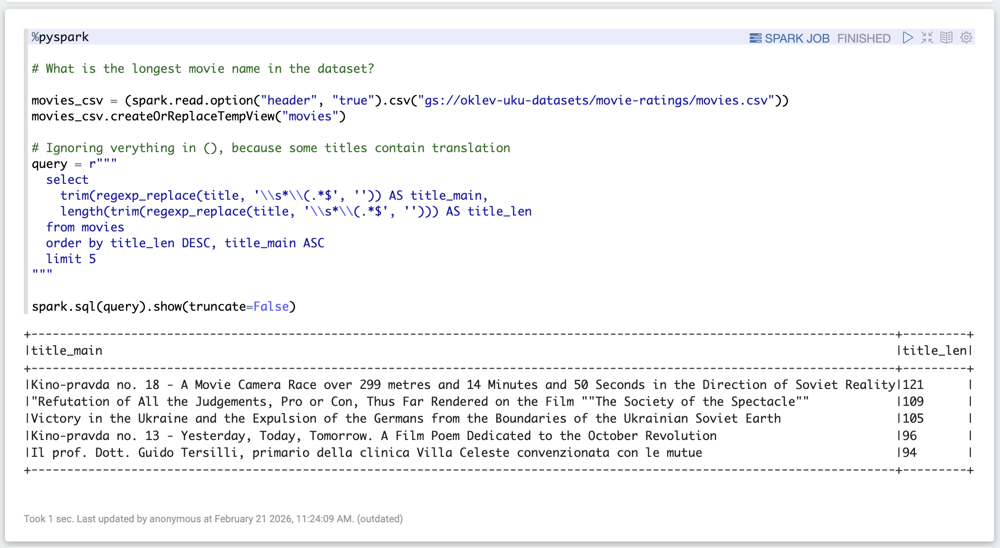
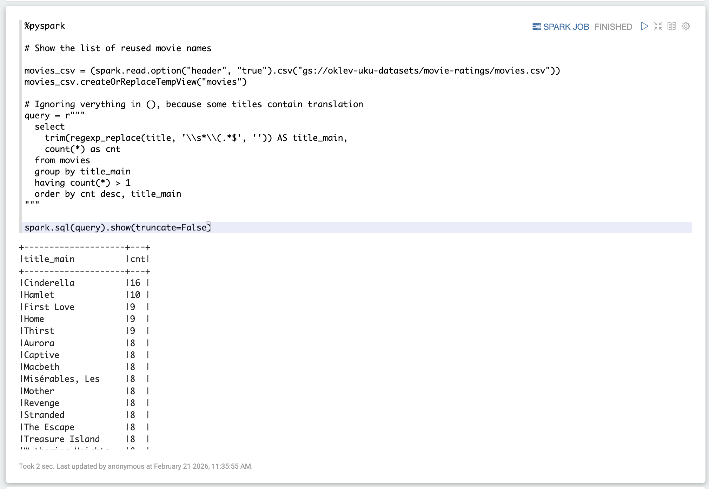
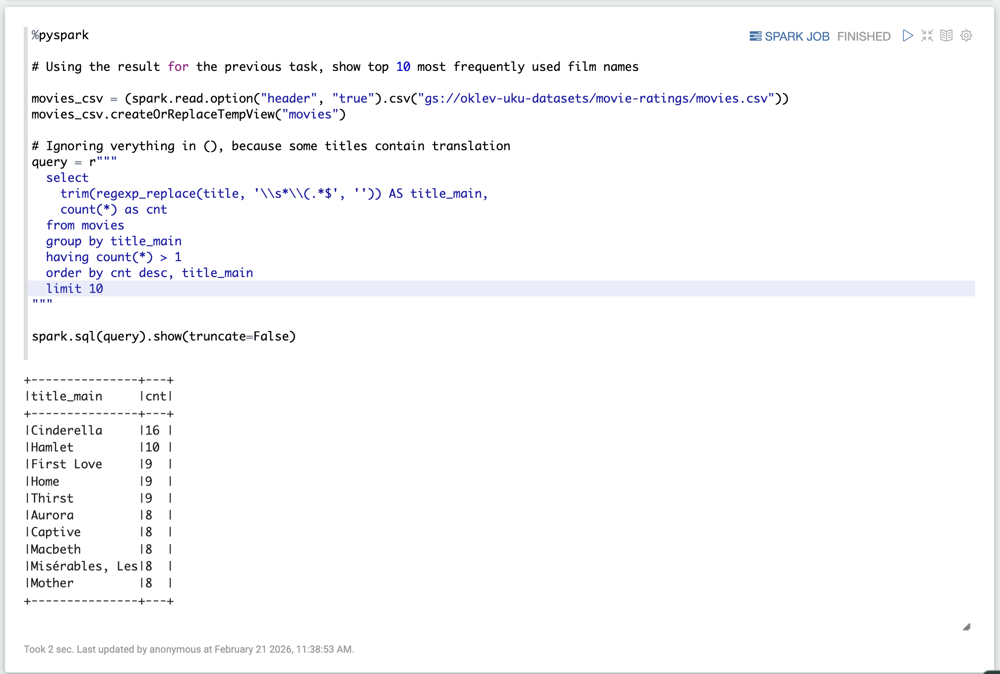

# Homework 5

### Find number of movies in the dataset

```zeppelin
%pyspark
# Find number of movies in the dataset

movies_csv = (spark.read.option("header", "true").csv("gs://oklev-uku-datasets/movie-ratings/movies.csv"))
movies_csv.createOrReplaceTempView("movies")
spark.sql("select count(*) as movies_cnt from movies").show()
```



### How many movies of "Comedy" genre database contains?
```zeppelin
%pyspark
# How many movies of "Comedy" genre database contains?
movies_csv = (spark.read.option("header", "true").csv("gs://oklev-uku-datasets/movie-ratings/movies.csv"))
movies_csv.createOrReplaceTempView("movies")

query = """
  select count(*) as movies_cnt
  from movies
  where array_contains(split(genres, '\\\\|'), 'Comedy')
"""
spark.sql(query).show()
```


### What are the yearliest and the latest years represented in the database?

```zeppelin
%pyspark

# What are the yearliest and the latest years represented in the database?

movies_csv = (spark.read.option("header", "true").csv("gs://oklev-uku-datasets/movie-ratings/movies.csv"))
movies_csv.createOrReplaceTempView("movies")

query = r"""
  select 
    min(cast(regexp_extract(title, '\\((\\d{4})\\)\\s*$', 1) as int)) as yearliest_year,
    max(cast(regexp_extract(title, '\\((\\d{4})\\)\\s*$', 1) as int)) as latest_year
  from movies
  WHERE regexp_extract(title, '\\((\\d{4})\\)\\s*$', 1) <> ''
"""

spark.sql(query).show()
```


### What is the minimum, average and maximum number of genres per single movie?
```zeppelin
%pyspark

# What is the minimum, average and maximum number of genres per single movie?

movies_csv = (spark.read.option("header", "true").csv("gs://oklev-uku-datasets/movie-ratings/movies.csv"))
movies_csv.createOrReplaceTempView("movies")

query = r"""
  select 
    min(movie_tags.cnt) as min_tags_cnt,
    avg(movie_tags.cnt) as avg_tags_cnt,
    max(movie_tags.cnt) as max_tags_cnt
  from (
    select array_size(split(genres, '\\|')) as cnt from movies
  ) as movie_tags
"""

spark.sql(query).show()
```


### For each genre, find the number of movies of that genre
```zeppelin
%pyspark

# For each genre, find the number of movies of that genre

movies_csv = (spark.read.option("header", "true").csv("gs://oklev-uku-datasets/movie-ratings/movies.csv"))
movies_csv.createOrReplaceTempView("movies")

query = r"""
  select 
    genre, count(movieId) as cnt
  from movies
  lateral view explode (split(genres, '\\|')) as genre
  group by genre
  sort by cnt desc, genre nulls last
"""

spark.sql(query).show()
```


### Show the list of unique genres represented in the dataset

```zeppelin
%pyspark

# Show the list of unique genres represented in the dataset

movies_csv = (spark.read.option("header", "true").csv("gs://oklev-uku-datasets/movie-ratings/movies.csv"))
movies_csv.createOrReplaceTempView("movies")

query = r"""
  select 
    distinct genre
  from movies
  lateral view explode (split(genres, '\\|')) as genre
  sort by genre nulls last
"""

spark.sql(query).show()
```


### What is the longest movie name in the dataset?
```zeppelin
%pyspark

# What is the longest movie name in the dataset?

movies_csv = (spark.read.option("header", "true").csv("gs://oklev-uku-datasets/movie-ratings/movies.csv"))
movies_csv.createOrReplaceTempView("movies")

# Ignoring verything in (), because some titles contain translation
query = r"""
  select 
    trim(regexp_replace(title, '\\s*\\(.*$', '')) AS title_main,
    length(trim(regexp_replace(title, '\\s*\\(.*$', ''))) AS title_len
  from movies
  order by title_len DESC, title_main ASC
  limit 5
"""

spark.sql(query).show(truncate=False)
```


### Show the list of reused movie names
```zeppelin
%pyspark

# Show the list of reused movie names

movies_csv = (spark.read.option("header", "true").csv("gs://oklev-uku-datasets/movie-ratings/movies.csv"))
movies_csv.createOrReplaceTempView("movies")

# Ignoring verything in (), because some titles contain translation
query = r"""
  select 
    trim(regexp_replace(title, '\\s*\\(.*$', '')) AS title_main,
    count(*) as cnt
  from movies
  group by title_main
  having count(*) > 1
  order by cnt desc, title_main
"""

spark.sql(query).show(truncate=False)
```



### Using the result for the previous task, show top 10 most frequently used film names
```zeppelin
%pyspark

# Using the result for the previous task, show top 10 most frequently used film names

movies_csv = (spark.read.option("header", "true").csv("gs://oklev-uku-datasets/movie-ratings/movies.csv"))
movies_csv.createOrReplaceTempView("movies")

# Ignoring verything in (), because some titles contain translation
query = r"""
  select 
    trim(regexp_replace(title, '\\s*\\(.*$', '')) AS title_main,
    count(*) as cnt
  from movies
  group by title_main
  having count(*) > 1
  order by cnt desc, title_main
  limit 10
"""

spark.sql(query).show(truncate=False)
```

