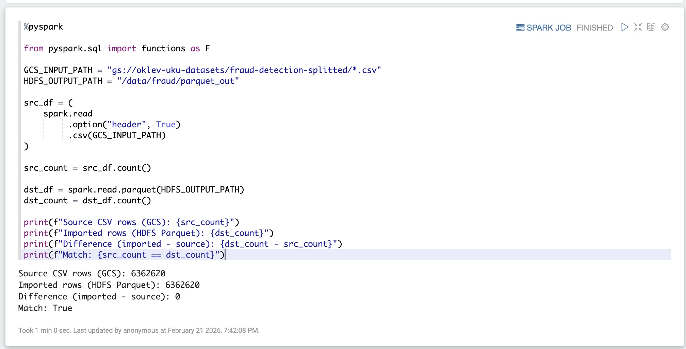
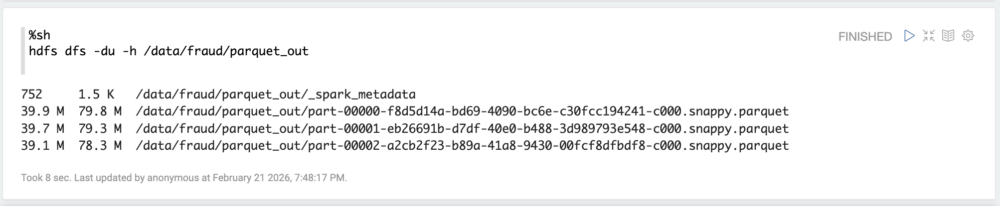

# Homework 6

### Data producer to Kafka

Reading from CSV and pushing it to a Kafka topic.
```zeppelin
%pyspark

from pyspark.sql import functions as F

kafka_auth_options = {
    "kafka.bootstrap.servers": "bootstrap.fraud-detection.us-central1.managedkafka.fluent-horizon-482915-t9.cloud.goog:9092",
    "kafka.security.protocol": "SASL_SSL",
    "kafka.sasl.mechanism": "OAUTHBEARER",
    "kafka.sasl.login.callback.handler.class": "com.google.cloud.hosted.kafka.auth.GcpLoginCallbackHandler",
    "kafka.sasl.jaas.config": "org.apache.kafka.common.security.oauthbearer.OAuthBearerLoginModule required;"
}

batch_csv = (
    spark.read
    .option("header", True)
    .csv("gs://oklev-uku-datasets/fraud-detection-splitted/*.csv")
)

to_kafka = batch_csv.select(F.to_json(F.struct("*")).alias("value"))

(to_kafka.write
    .format("kafka")
    .options(**kafka_auth_options)
    .option("topic", "fraud-detection-4")
    .save())
```

### Data consumer from the Kafka topic and writer to HDFS
```zeppelin
%pyspark

from pyspark.sql import functions as F

kafka_auth_options = {
    "kafka.bootstrap.servers": "bootstrap.fraud-detection.us-central1.managedkafka.fluent-horizon-482915-t9.cloud.goog:9092",
    "kafka.security.protocol": "SASL_SSL",
    "kafka.sasl.mechanism": "OAUTHBEARER",
    "kafka.sasl.login.callback.handler.class": "com.google.cloud.hosted.kafka.auth.GcpLoginCallbackHandler",
    "kafka.sasl.jaas.config": "org.apache.kafka.common.security.oauthbearer.OAuthBearerLoginModule required;"
}

try:
    csv_schema
except NameError:
    GCS_INPUT_PATH = "gs://oklev-uku-datasets/fraud-detection-splitted/*.csv"
    csv_schema = (
        spark.read
        .option("header", True)
        .option("inferSchema", True)
        .csv(GCS_INPUT_PATH)
        .schema
    )

kafka_raw = (
    spark.readStream
    .format("kafka")
    .options(**kafka_auth_options)
    .option("subscribe", "fraud-detection-4")
    .option("startingOffsets", "earliest")
    .load()
)

parsed = (
    kafka_raw
    .select(F.col("value").cast("string").alias("json_str"))
    .select(F.from_json(F.col("json_str"), csv_schema).alias("r"))
    .select("r.*")
)

consumer_query = (
    parsed.writeStream
    .format("parquet")
    .option("path", "hdfs://uku-vn-dataproc-1-m/data/fraud/parquet_out")
    .option("checkpointLocation", "hdfs://uku-vn-dataproc-1-m/tmp/chk/fraud_kfk_to_hdfs_parquet5")
    .outputMode("append")
    .trigger(availableNow=True)
    .start()
)

consumer_query.awaitTermination()
```

### Check if all data was persisted
```zeppelin
%pyspark

from pyspark.sql import functions as F

GCS_INPUT_PATH = "gs://oklev-uku-datasets/fraud-detection-splitted/*.csv"
HDFS_OUTPUT_PATH = "/data/fraud/parquet_out"

src_df = (
    spark.read
         .option("header", True)
         .csv(GCS_INPUT_PATH)
)

src_count = src_df.count()

dst_df = spark.read.parquet(HDFS_OUTPUT_PATH)
dst_count = dst_df.count()

print(f"Source CSV rows (GCS): {src_count}")
print(f"Imported rows (HDFS Parquet): {dst_count}")
print(f"Difference (imported - source): {dst_count - src_count}")
print(f"Match: {src_count == dst_count}")
```



```zeppelin
%sh
hdfs dfs -du -h /data/fraud/parquet_out
```
